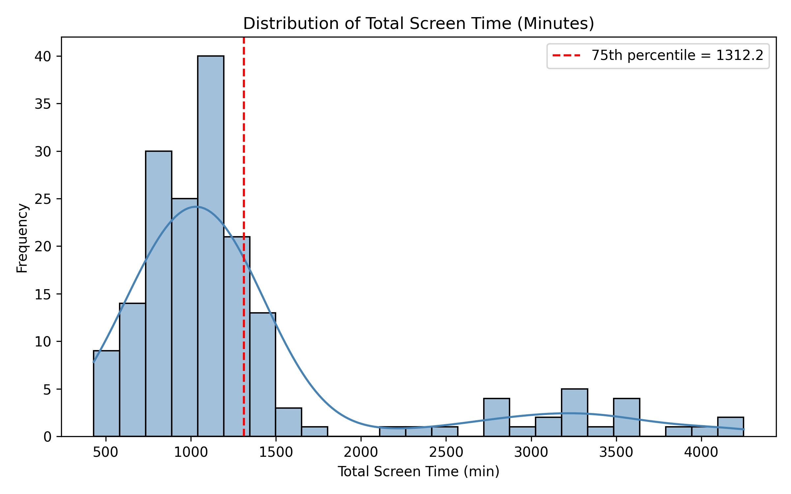
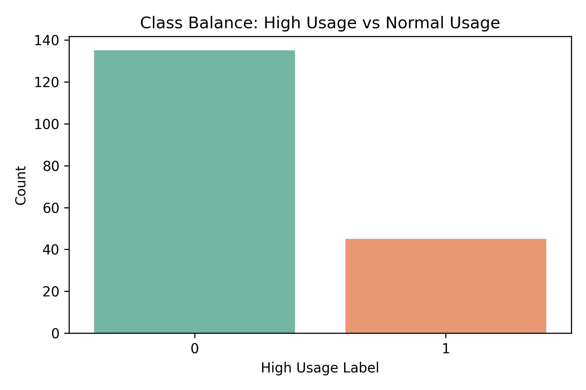
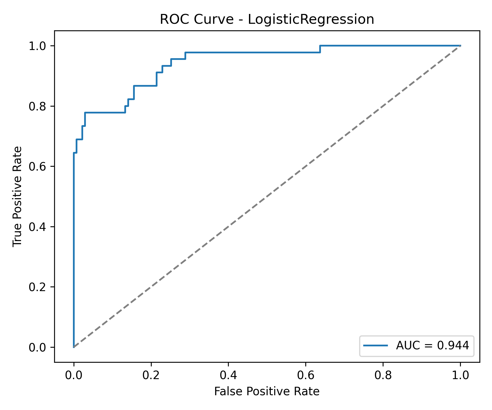
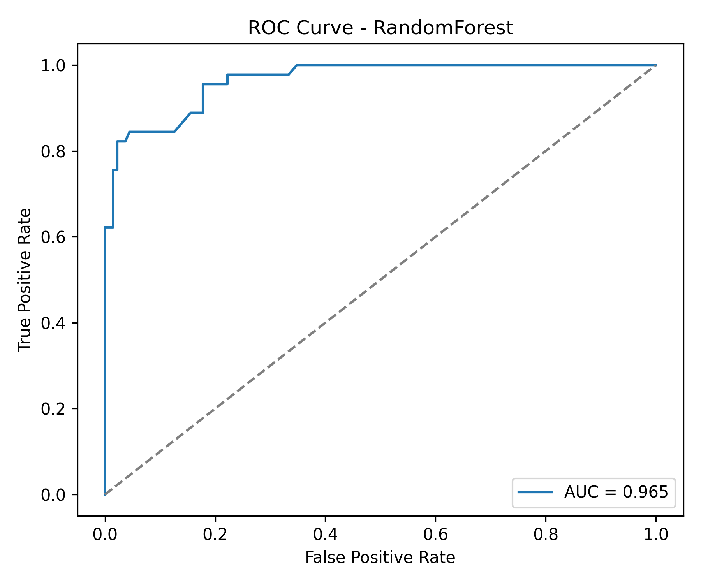
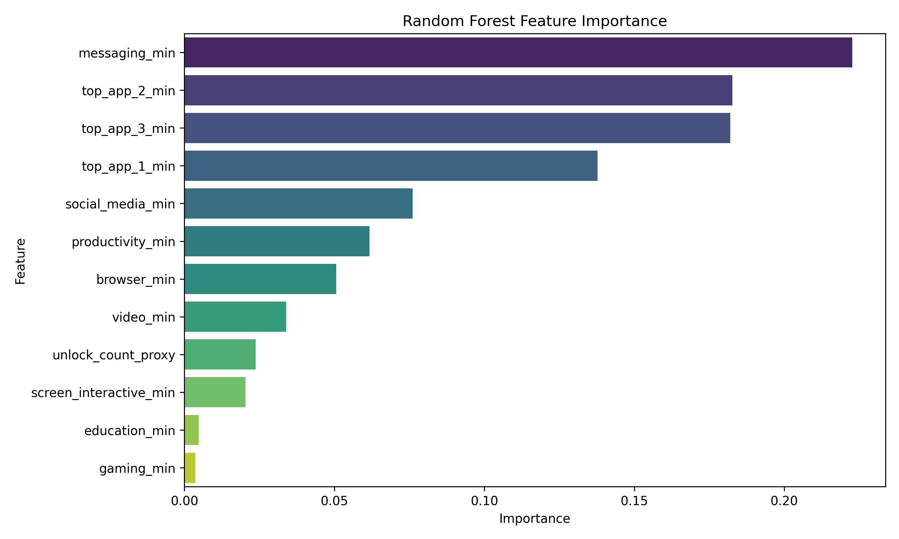
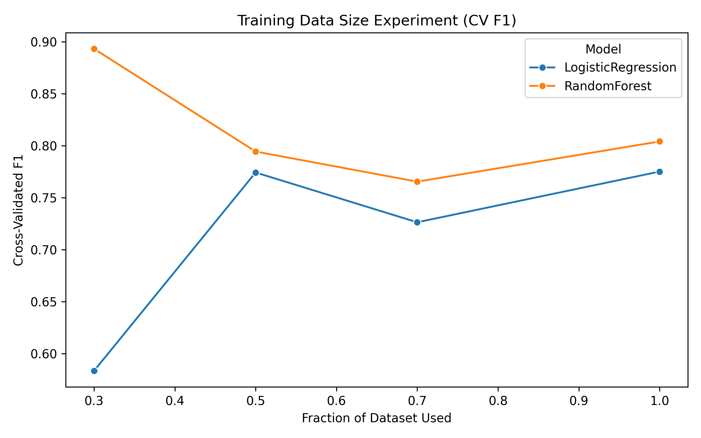

# Predicting High Smartphone Usage Days from Android Daily Usage Statistics



## Overview

This project investigates whether daily Android smartphone usage patterns can predict whether a given day will be a **high screen-time day** or a **normal screen-time day**.

The idea was inspired by the weekly digital wellbeing summary on a **Samsung S24 Ultra**. Each week, Samsung Wellbeing provides short behavioral insights such as whether the phone was used more or less than the previous week. Motivated by this, this project explores a more fine-grained version of the same idea: instead of comparing usage **week by week**, the goal here is to predict unusually high usage at the **day level**.

---
## Repository Structure

```text
AI-Usage-Dataset/
├── README.md
├── data/
│   ├── dail_summary_new.csv
├── code/
│   └── train.py
└── output/
    ├── model_results_summary.csv
    ├── class_balance.png
    ├── total_screen_time_histogram.png
    ├── roc_curve_LogisticRegression.png
    ├── roc_curve_RandomForest.png
    ├── random_forest_feature_importance.png
    └── training_size_experiment_f1.png
```
---

## Research Question

> **Can daily Android device usage patterns predict whether a day is a high screen-time day or a normal screen-time day?**

---

## Dataset

The dataset was collected using a **custom Android exporter app** developed specifically for this project. The exporter queried Android’s usage statistics framework and generated two CSV files:

- **`data/dail_summary_new.csv`** — one row per day  
- **`data/app_usage_daily.csv`** — one row per app per day  

The main machine-learning dataset used in this project is **`dail_summary_new.csv`**.

### Main dataset summary
- **Dataset name:** `dail_summary_new`
- **Task type:** Binary classification
- **Number of samples:** 180 daily records
- **Sample unit:** One row = one full day of smartphone usage
- **Device used:** Samsung S24 Ultra
- **Format:** CSV

---

## Main Fields in `dail_summary_new.csv`

Each row summarizes one day of smartphone usage with the following fields:

- `date`
- `total_screen_time_min`
- `screen_interactive_min`
- `unlock_count_proxy`
- `top_app_1`
- `top_app_1_min`
- `top_app_2`
- `top_app_2_min`
- `top_app_3`
- `top_app_3_min`
- `social_media_min`
- `messaging_min`
- `video_min`
- `browser_min`
- `productivity_min`
- `education_min`
- `gaming_min`

### Example daily record

| date | total_screen_time_min | screen_interactive_min | unlock_count_proxy | top_app_1 | top_app_1_min | top_app_2 | top_app_2_min | top_app_3 | top_app_3_min |
|---|---:|---:|---:|---|---:|---|---:|---|---:|
| 2025-09-19 | 1134 | 552 | 134 | com.whatsapp.w4b | 142 | com.whatsapp | 103 | org.telegram.messenger | 59 |

---

## Label Definition

For supervised learning, a binary target label was created from `total_screen_time_min`:

- **`high_usage_label = 1`** if daily screen time is above the **75th percentile**
- **`high_usage_label = 0`** otherwise

This resulted in:

- **135 normal-usage days**
- **45 high-usage days**

---

## Data Collection Process

The dataset was collected from the author’s Android phone using a custom-built exporter application.

### Export process
The exporter app:
- queried Android usage statistics over daily time windows,
- retrieved app-level usage history,
- extracted event-based interaction records,
- and converted the raw records into structured CSV files.

### Derived daily features
Some fields were directly exported, while others were derived from usage events:

- **`screen_interactive_min`** was computed from the duration between interactive-screen start and end events.
- **`unlock_count_proxy`** was computed as a proxy count of daily device unlocks.
- **`top_app_1`, `top_app_2`, `top_app_3`** were selected by ranking apps according to daily usage time.
- **Category-level features** such as `messaging_min` and `social_media_min` were obtained by grouping apps into manually defined categories and summing their daily usage.

---

## Methods

Two supervised learning methods were evaluated:

1. **Logistic Regression**
2. **Random Forest Classifier**

### Input features used for classification
- `screen_interactive_min`
- `unlock_count_proxy`
- `top_app_1_min`
- `top_app_2_min`
- `top_app_3_min`
- `social_media_min`
- `messaging_min`
- `video_min`
- `browser_min`
- `productivity_min`
- `education_min`
- `gaming_min`

The field `total_screen_time_min` was **not** used as an input feature because it was used to define the target label and would otherwise cause target leakage.

### Evaluation metrics
The models were evaluated using cross-validation with the following metrics:

- Accuracy
- Precision
- Recall
- F1-score
- AUROC
- Confusion Matrix

---

## Results Summary

### Cross-validated model comparison

| Model | CV Accuracy | CV Precision | CV Recall | CV F1 | CV AUROC |
|---|---:|---:|---:|---:|---:|
| Logistic Regression | 0.872 | 0.732 | 0.778 | 0.746 | 0.947 |
| Random Forest | 0.922 | 0.947 | 0.733 | 0.816 | 0.960 |

### Main takeaway
Both models performed well, but **Random Forest achieved the strongest overall performance**. It obtained the best accuracy, F1-score, and AUROC, while Logistic Regression achieved slightly higher recall.

---

## Visual Results

### Class balance


### ROC curves



### Random Forest feature importance


### Training size experiment


---

